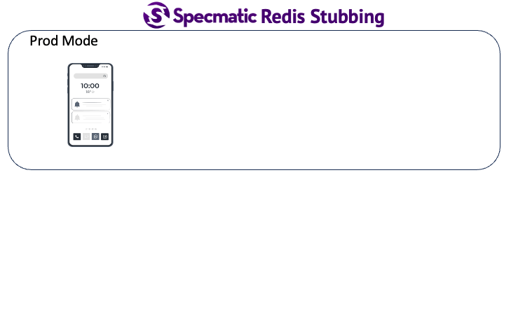

# Private Beta



This project demonstrates how to stub out Redis using specmatic-redis. Please contact us at https://specmatic.io for access to the distributable.

## Instructions to try this out

### Pre-requisites
1. Java 17 or higher
2. Access to Specmatic-Redis distributable
3. Update build.gradle with the path to the Specmatic Redis distributable to where it is extracted to on your machine.

### Running the tests
```shell
./gradlew clean build
```
